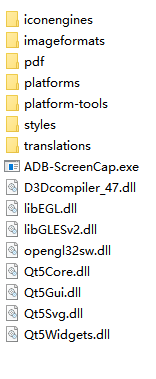

# ADB-ScreenCap
使用ADB工具, 用于快速对手机界面截图(电子书阅读界面截图)

对加密电子书进行截图保存

[ADB 下载](https://dl.google.com/android/repository/platform-tools-latest-windows.zip)

下载完成, 将其解压, 并将文件夹复制到与 ADB-ScreenCap.exe 同级目录下

得到所有截图图片后, 可以用 Word 制作 PDF
